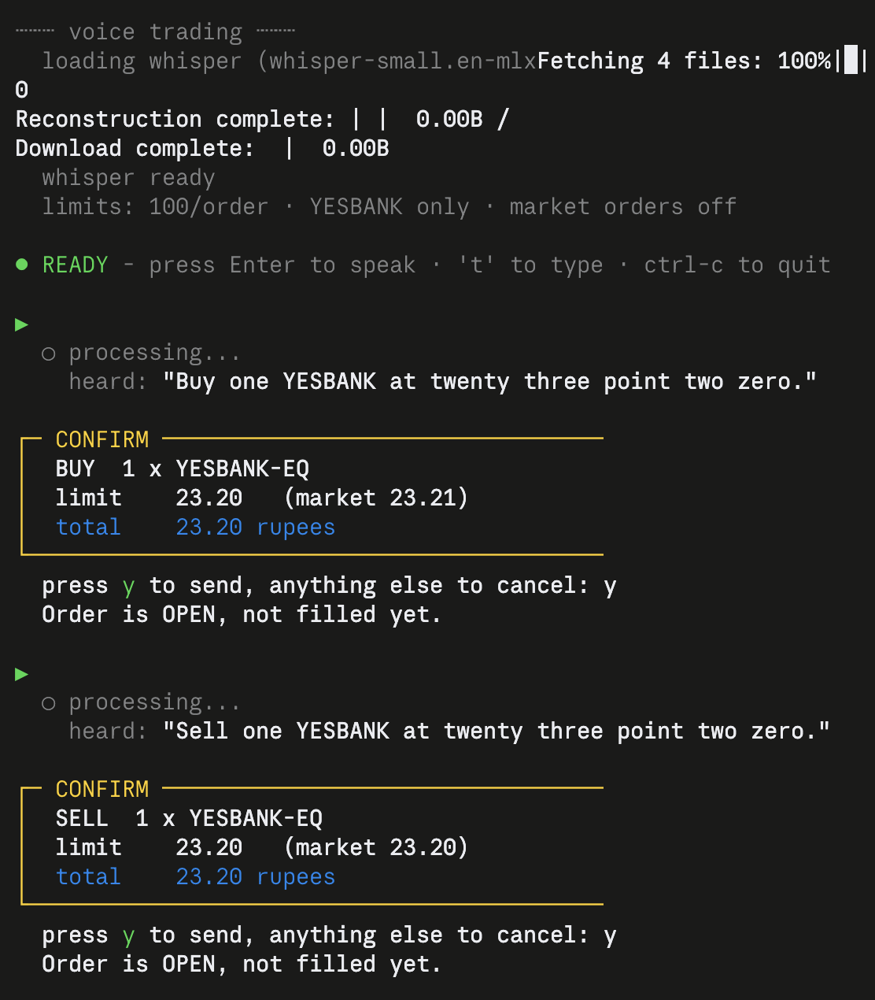
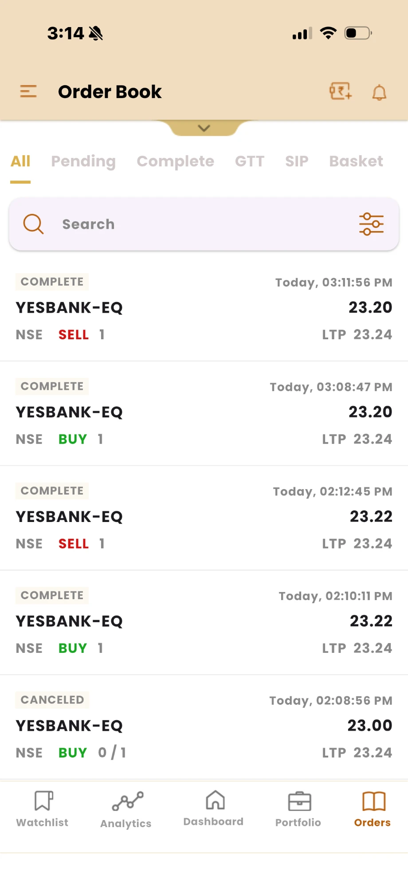

# Sayso

**Nothing trades without your say-so.**

Sayso is a voice interface for placing real trades on the Indian stock
market, built on the [Shoonya](https://shoonya.com) broker API. You say
*"buy one yesbank at twenty three point two zero"*; it transcribes you,
works out which instrument you meant, prices the order against live market
depth, checks it against hard safety limits, and shows you exactly what it
is about to do. Only then, and only if you press `y`, does it reach the
exchange.

Speech recognition runs locally via Whisper — no audio leaves your machine,
and nothing but the order itself is sent anywhere.

**What's in here:**

- **A working Shoonya API client** (`shoonya/`) — OAuth login with session
  caching, symbol search, live quotes with market depth, order placement
  that surfaces real rejection reasons, and position tracking that reads the
  right P&L field. Useful on its own, with no voice involved.
- **A voice layer** (`voice/`) — local speech recognition, an intent parser
  that understands spoken numbers ("twenty three point two two" → 23.22),
  and a confirmation flow.
- **Safety limits that actually hold** — a symbol allowlist, per-order and
  per-day value caps that survive a restart, market orders disabled by
  default, circuit-band and tick-size validation, and a refusal to guess
  between similarly named instruments.
- **Field notes on the Shoonya API** (below) — the undocumented behaviour and
  misleading field names that cost a day to find.

It is a first iteration: it works, it has placed real trades, and it is
honest about what it cannot do yet.



*Two voice commands, two live orders on NSE.*

### Independently verified

The same trades, in Shoonya's own order book — timestamps matching the
terminal session exactly:



| Time | Side | Price | Status | Placed by |
|---|---|---|---|---|
| 15:11:56 | SELL 1 YESBANK-EQ | 23.20 | COMPLETE | **voice** |
| 15:08:47 | BUY 1 YESBANK-EQ | 23.20 | COMPLETE | **voice** |
| 14:12:45 | SELL 1 YESBANK-EQ | 23.22 | COMPLETE | API |
| 14:10:11 | BUY 1 YESBANK-EQ | 23.22 | COMPLETE | API |
| 14:08:56 | BUY 1 YESBANK-EQ | 23.00 | CANCELED | API |

Two complete round trips on 23 September 2026 — the second placed entirely
by speaking. Total cost in brokerage: ₹0.07.

> ### ⚠️ This places real orders with real money
>
> There is no paper-trading mode. Every confirmed order goes to a live
> exchange against a funded account. This is a **first iteration built to
> test the concept** — it is not audited, not battle-tested, and not
> financial advice. Trade sizes you are willing to lose entirely, and read
> the Limitations section before using it.

---

## How it works

```
mic → Whisper (local) → parser → resolve symbol → live quote
                                                      ↓
                                            safety limits
                                                      ↓
                                     typed confirmation  ← you press y
                                                      ↓
                                              Shoonya API
```

Voice proposes, you dispose. Speech never places an order on its own — the
confirmation box showing the resolved instrument, price and total cost
always requires a typed `y`. That is deliberate: ASR mishears, parsers
misread, and the cost of a wrong guess here is money.

## Tutorial

New to this? [TUTORIAL.md](TUTORIAL.md) walks from a fresh clone to your
first voice-placed trade, including what each step should print.

## Setup

Requires Python 3.12+, macOS (Apple Silicon for the MLX Whisper build), and a
[Shoonya](https://shoonya.com) account with API access.

```bash
python3.12 -m venv .venv
.venv/bin/pip install -r requirements.txt
cp .env.example .env    # then fill in your credentials
```

Log in once per trading day (tokens are day-scoped):

```bash
.venv/bin/python -m shoonya.login
```

Check the API works before adding voice:

```bash
.venv/bin/python smoke_test.py      # read-only: funds, positions, quotes
```

Then:

```bash
.venv/bin/python -m voice.main
```

Press Enter to speak, `t` to type instead. If the mic returns silence, run
`.venv/bin/python -m voice.miccheck` — it reports levels and tells you what
to change.

## What you can say

```
what's yesbank at
funds
what do i own
buy one yesbank
buy two yesbank at twenty three point two zero
sell my yesbank
what are my limits
```

Spoken prices ("twenty three point two two") are more reliable than digits,
because the decoder no longer has to place a decimal point itself.

## Safety

Hard limits live in `voice/safety.py` and are enforced in code regardless of
what was said or parsed:

| Limit | Default |
|---|---|
| Symbol allowlist | `YESBANK` only |
| Max value per order | ₹100 |
| Max quantity per order | 50 |
| Market orders | disabled (limit orders only) |
| Orders per day | 20 |
| Value per day | ₹500 |

Daily counters persist to disk, so restarting does not reset your allowance.

Beyond those: ambiguous symbol names are **refused**, not guessed — asking for
"nifty" will not silently buy an ETF; limit prices are validated against the
instrument's daily circuit band and snapped to its tick size before sending.

## Limitations

Known and deliberate, as of the first iteration:

- **The parser is hand-rolled** and handles the phrasings its author thought
  of. Unanticipated wording fails safe ("I didn't catch an instruction")
  rather than dangerously, but it fails. Replacing `voice/parser.py:parse()`
  with an LLM call is the obvious next step; the signature is stable.
- **Spoken tickers rely on an alias table** (`voice/aliases.py`). Whisper
  renders YESBANK as "yes bank" or "years bank"; every new symbol needs an
  entry. Does not scale past testing.
- **No spoken output.** Responses print to screen.
- **No cancel or modify by voice.** You can open a position by voice but not
  unwind one.
- **No websocket.** Fills are polled after a fixed delay, not pushed.
- **macOS only**, and the Whisper backend is Apple Silicon specific.
- **No tests.**

## Notes on the Shoonya API

Things that cost time to discover, documented here so they cost you less:

- **The published quick-start does not match the shipped SDK.** There is no
  `gen_access_token()` — calling it raises `AttributeError`. The real method
  is `getAccessToken(authcode, secret_code, client_id, uid)`, it computes the
  SHA256 checksum internally, and it returns a *tuple*, not a dict with
  `susertoken`. See `quickstart.py` for the flow that actually works.
- **`stat: "Ok"` from `place_order` means received, not accepted.** An order
  can return an order number and be rejected by the exchange moments later.
  Always confirm against the order book.
- **`NorenApi.place_order` returns `None` on any failure**, discarding the
  broker's `emsg` — the only field saying *why*. This project POSTs directly
  so rejection reasons survive.
- **`cash` reads `0.00` even with a funded account.** `mr_eqt_a` is closer to
  buying power, but disagreed with the broker's own app by ₹14 in testing.
  Trust positions and the trade book.
- **`rpnl` is realised P&L** and stays `0.00` while a position is open. Use
  `urmtom` for unrealised mark-to-market.
- **T+1 settlement:** a same-day delivery buy appears in *positions*, not
  *holdings*. "What do I own" must check both.
- **Indices are not tradeable** (`nontrd: "1"`). Nifty exposure means ETFs or
  F&O, not token 26000.

## Licence

MIT — see [LICENSE](LICENSE).
