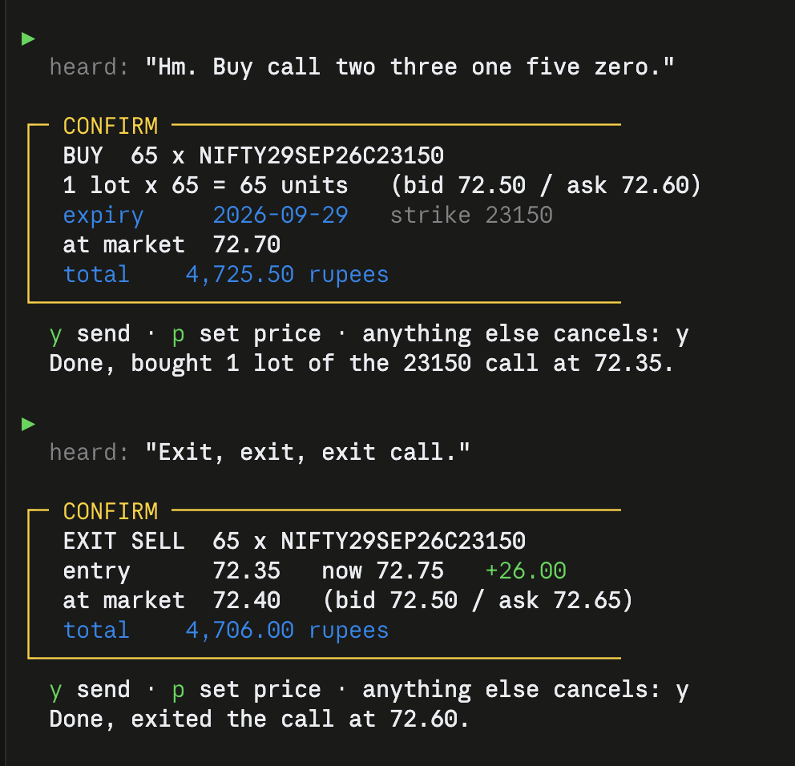
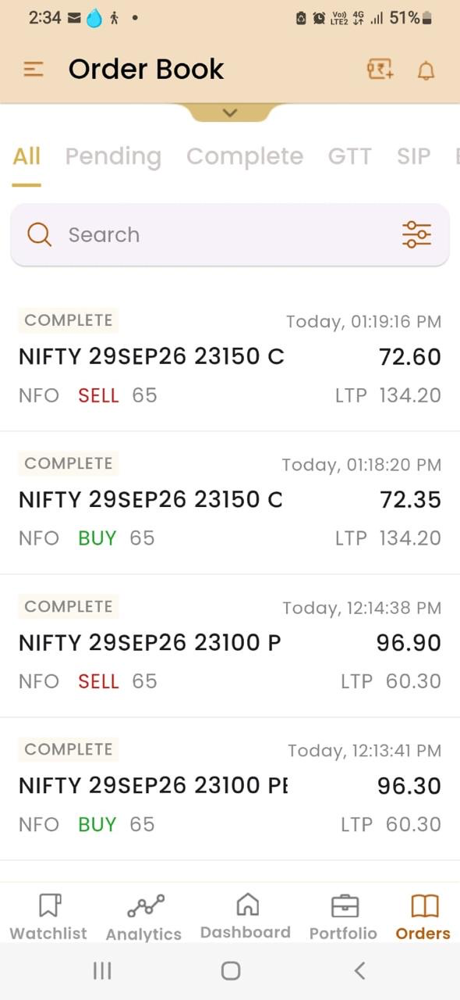
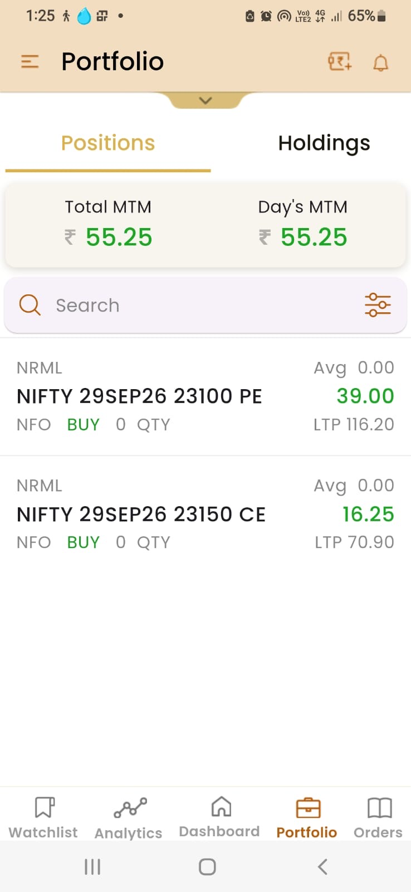
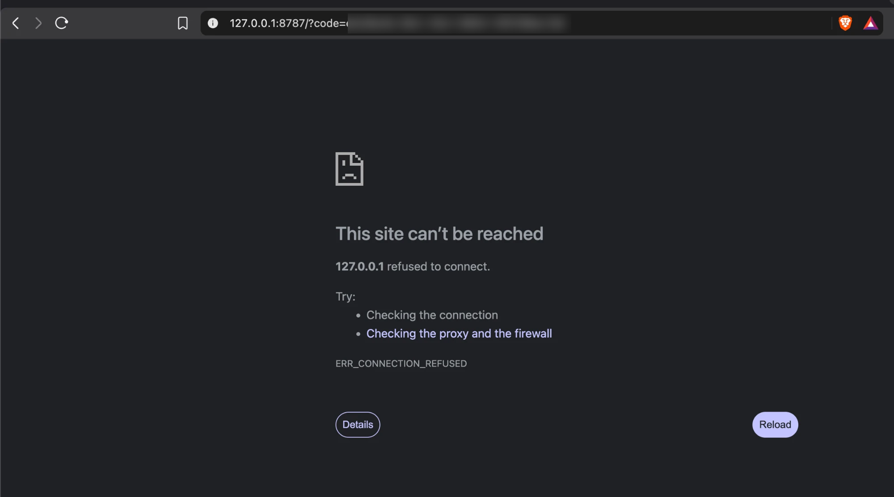

# Sayso

**Nothing trades without your say-so.**

Sayso is a voice interface for placing real trades on the Indian stock
market, built on the [Shoonya](https://shoonya.com) broker API. You say
*"buy one yesbank at twenty three point two zero"*; it transcribes you,
works out which instrument you meant, prices the order against live market
depth, checks it against hard safety limits, and shows you exactly what it
is about to do. Only then, and only if you press `y`, does it reach the
exchange.

Speech recognition runs locally via Whisper — no audio leaves your machine,
and nothing but the order itself is sent anywhere.

**What's in here:**

- **A working Shoonya API client** (`shoonya/`) — OAuth login with session
  caching, symbol search, live quotes with market depth, order placement
  that surfaces real rejection reasons, and position tracking that reads the
  right P&L field. Useful on its own, with no voice involved.
- **A voice layer** (`voice/`) — local speech recognition, an intent parser
  that understands spoken numbers ("twenty three point two two" → 23.22),
  and a confirmation flow.
- **Safety limits that actually hold** — a symbol allowlist, per-order and
  per-day value caps that survive a restart, market orders disabled by
  default, circuit-band and tick-size validation, and a refusal to guess
  between similarly named instruments.
- **Nifty options** — nearest weekly expiry, at-the-money by default, or any
  listed strike you name. Contracts resolve from the broker's own symbol
  master, so nothing is ever constructed by hand.
- **Field notes on the Shoonya API** (below) — the undocumented behaviour and
  misleading field names that cost days to find.

It works, it has placed real trades in both equity and options, and it is
honest about what it cannot do yet.


*Two voice commands, two live orders on NSE.*

### Nifty options, by voice



*"Buy call two three one five zero" — no symbol, no expiry, no price. It
reads the live Nifty level, picks the nearest weekly expiry, resolves
strike 23150 against the listed ladder, and prices through the spread.
"Exit call" closes the whole position and reports the P&L first.*

Two complete round trips on 25 September 2026, both closed within minutes:

| Time | Contract | Side | Price | Result |
|---|---|---|---|---|
| 12:13:41 | NIFTY 29SEP26 23100 PE | BUY 65 | 96.30 | |
| 12:14:38 | NIFTY 29SEP26 23100 PE | SELL 65 | 96.90 | **+₹39.00** |
| 13:18:20 | NIFTY 29SEP26 23150 CE | BUY 65 | 72.35 | |
| 13:19:16 | NIFTY 29SEP26 23150 CE | SELL 65 | 72.60 | **+₹16.25** |

<p>


</p>

*The broker's own order book and portfolio, confirming the same four fills
and ₹55.25 total. Each leg is 65 units — one Nifty lot.*

### Equity, independently verified

The same trades, in Shoonya's own order book — timestamps matching the
terminal session exactly:


| Time | Side | Price | Status | Placed by |
|---|---|---|---|---|
| 15:11:56 | SELL 1 YESBANK-EQ | 23.20 | COMPLETE | **voice** |
| 15:08:47 | BUY 1 YESBANK-EQ | 23.20 | COMPLETE | **voice** |
| 14:12:45 | SELL 1 YESBANK-EQ | 23.22 | COMPLETE | API |
| 14:10:11 | BUY 1 YESBANK-EQ | 23.22 | COMPLETE | API |
| 14:08:56 | BUY 1 YESBANK-EQ | 23.00 | CANCELED | API |

Two complete round trips on 23 September 2026 — the second placed entirely
by speaking. Total cost in brokerage: ₹0.07.

> ### ⚠️ This places real orders with real money
>
> There is no paper-trading mode. Every confirmed order goes to a live
> exchange against a funded account. This is a **first iteration built to
> test the concept** — it is not audited, not battle-tested, and not
> financial advice. Trade sizes you are willing to lose entirely, and read
> the Limitations section before using it.

---

## How it works

```
mic → Whisper (local) → parser → resolve symbol → live quote
                                                      ↓
                                            safety limits
                                                      ↓
                                     typed confirmation  ← you press y
                                                      ↓
                                              Shoonya API
```

Voice proposes, you dispose. Speech never places an order on its own — the
confirmation box showing the resolved instrument, price and total cost
always requires a typed `y`. That is deliberate: ASR mishears, parsers
misread, and the cost of a wrong guess here is money.

## Tutorial

New to this? [TUTORIAL.md](TUTORIAL.md) walks from a fresh clone to your
first voice-placed trade, including what each step should print.

## Setup

Requires Python 3.12+, a microphone, and a [Shoonya](https://shoonya.com)
account with API access. Runs on macOS and Windows; speech recognition uses
MLX on Apple Silicon and faster-whisper elsewhere, both fully local.

```bash
./setup.sh                                    # macOS / Linux
powershell -ExecutionPolicy Bypass -File setup.ps1   # Windows
```

Then four short steps — the first two are once per machine, the third is
once per trading day:

```bash
.venv/bin/python -m shoonya.credentials   # asks for your API credentials
.venv/bin/python -m voice.calibrate       # measures your microphone
.venv/bin/python -m shoonya.login         # once per trading day
.venv/bin/python -m voice.main            # run it
```

Login opens the broker's page in your browser. Afterwards it redirects to
`127.0.0.1`, which shows a connection error — **that is expected**. Nothing
listens on that port; the login code is in the address bar, and that is what
you paste back.



Your password and OTP go to the broker, never to this program. All it ever
sees is a short-lived, single-use code.

If anything misbehaves, this names the fix for each problem it finds:

```bash
.venv/bin/python -m voice.doctor
```

Press Enter to speak, `t` to type instead.

> **Microphone calibration is not optional.** The threshold that decides
> "you stopped talking" depends on your microphone and your room. Running
> `voice.calibrate` measures both and places the threshold between them.
> Without it, the app will tell you it is uncalibrated rather than guess.

## What you can say

**Options** — Nifty, nearest weekly expiry, at the money unless you say a
strike:

```
buy call                      buy put
what is the call at           what is the put at
buy 23100 call                buy twenty three fifty put
buy call two three one five zero      (digit by digit also works)
buy 2 lots of 23100 call
exit call                     exit put
```

Strikes are resolved against the live ladder, so "twenty three fifty"
becomes 23050 and an unlisted strike like 23075 is refused rather than
rounded. A genuinely ambiguous one ("twenty three hundred" — 23,000 or
23,100?) asks rather than guessing.

**Equity:**

```
what is yesbank at            buy one yesbank
sell one yesbank              dump my yesbank
```

**Account:**

```
funds        what do i own        show me my orders        what are my limits
```

Phrasing is flexible — "grab me a put", "go long call", "square off my
call" and "flatten my put" all work.

## Safety

Hard limits live in `voice/safety.py` and are enforced in code regardless of
what was said or parsed:

| Limit | Default |
|---|---|
| Option underlyings | `NIFTY` only |
| Max lots per order | 10 |
| Max premium per unit | ₹200 |
| Option orders per day | 10 |
| Equity allowlist | `YESBANK` only |
| Max equity order value | ₹100 |
| Equity orders per day | 20 |

Daily counters persist to disk, so restarting does not reset your allowance.

Beyond those: ambiguous names and strikes are **refused**, not guessed;
selling options to open is refused outright; prices are validated against the
instrument's circuit band and snapped to its tick size; and every order shows
lots, units and total before it can be sent.

Orders go at market — Shoonya rejects `MKT` outright, so "at market" is a
limit priced two ticks through the touch, which fills immediately with a
bounded worst case. Press `p` at the confirmation to set your own limit
instead.

## Limitations

Known and deliberate:

- **The parser is hand-rolled** and handles the phrasings its author thought
  of. Unanticipated wording fails safe ("I didn't catch an instruction")
  rather than dangerously, but it fails. Replacing `voice/parser.py:parse()`
  with an LLM call is the obvious next step; the signature is stable.
- **Spoken tickers rely on an alias table** (`voice/aliases.py`). Whisper
  renders YESBANK as "yes bank" or "years bank"; every new symbol needs an
  entry. Does not scale past testing.
- **No spoken output.** Responses print to screen.
- **No cancel or modify by voice.** You can open and close positions by
  voice, but a resting order has to be cancelled elsewhere.
- **No websocket.** Fills are checked shortly after placing, not pushed.
- **Windows is written but untested** — the setup script, the
  faster-whisper backend and the platform-conditional dependencies are all
  in place, but no Windows machine was available to run them.
- **Tests cover the risky parsing only** (`tests/test_strikes.py`). The
  broker layer has none.

## Notes on the Shoonya API

Things that cost time to discover, documented here so they cost you less:

- **The published quick-start does not match the shipped SDK.** There is no
  `gen_access_token()` — calling it raises `AttributeError`. The real method
  is `getAccessToken(authcode, secret_code, client_id, uid)`, it computes the
  SHA256 checksum internally, and it returns a *tuple*, not a dict with
  `susertoken`. See `quickstart.py` for the flow that actually works.
- **`stat: "Ok"` from `place_order` means received, not accepted.** An order
  can return an order number and be rejected by the exchange moments later.
  Always confirm against the order book.
- **`NorenApi.place_order` returns `None` on any failure**, discarding the
  broker's `emsg` — the only field saying *why*. This project POSTs directly
  so rejection reasons survive.
- **`cash` reads `0.00` even with a funded account.** `mr_eqt_a` is closer to
  buying power, but disagreed with the broker's own app by ₹14 in testing.
  Trust positions and the trade book.
- **`rpnl` is realised P&L** and stays `0.00` while a position is open. Use
  `urmtom` for unrealised mark-to-market.
- **T+1 settlement:** a same-day delivery buy appears in *positions*, not
  *holdings*. "What do I own" must check both.
- **Indices are not tradeable** (`nontrd: "1"`). Nifty exposure means ETFs or
  F&O, not token 26000.

## Licence

MIT — see [LICENSE](LICENSE).
