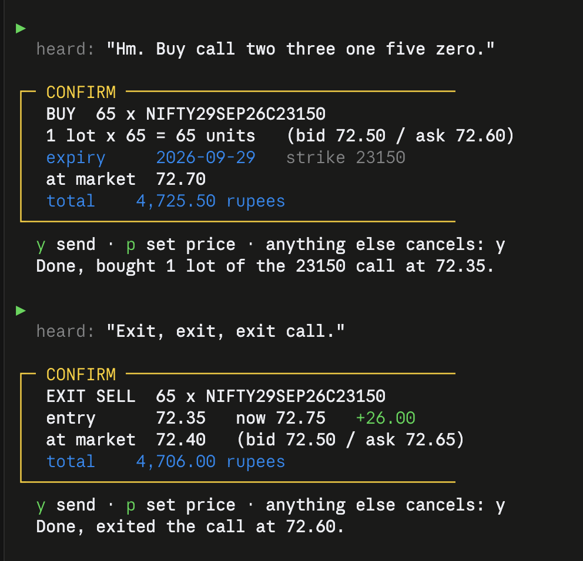
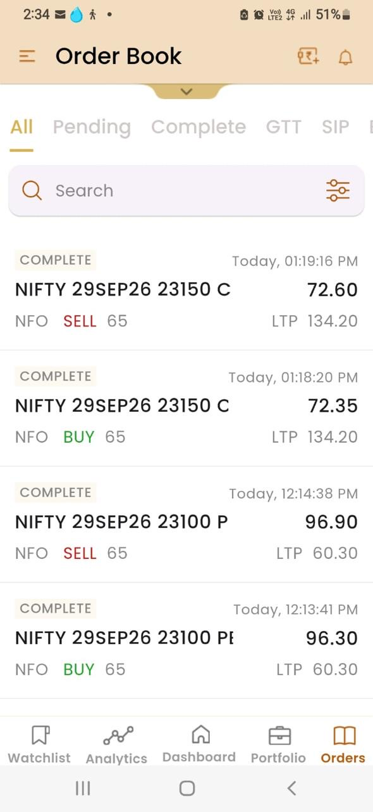
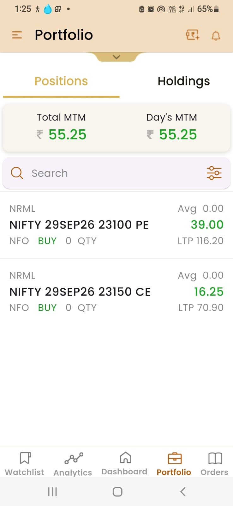
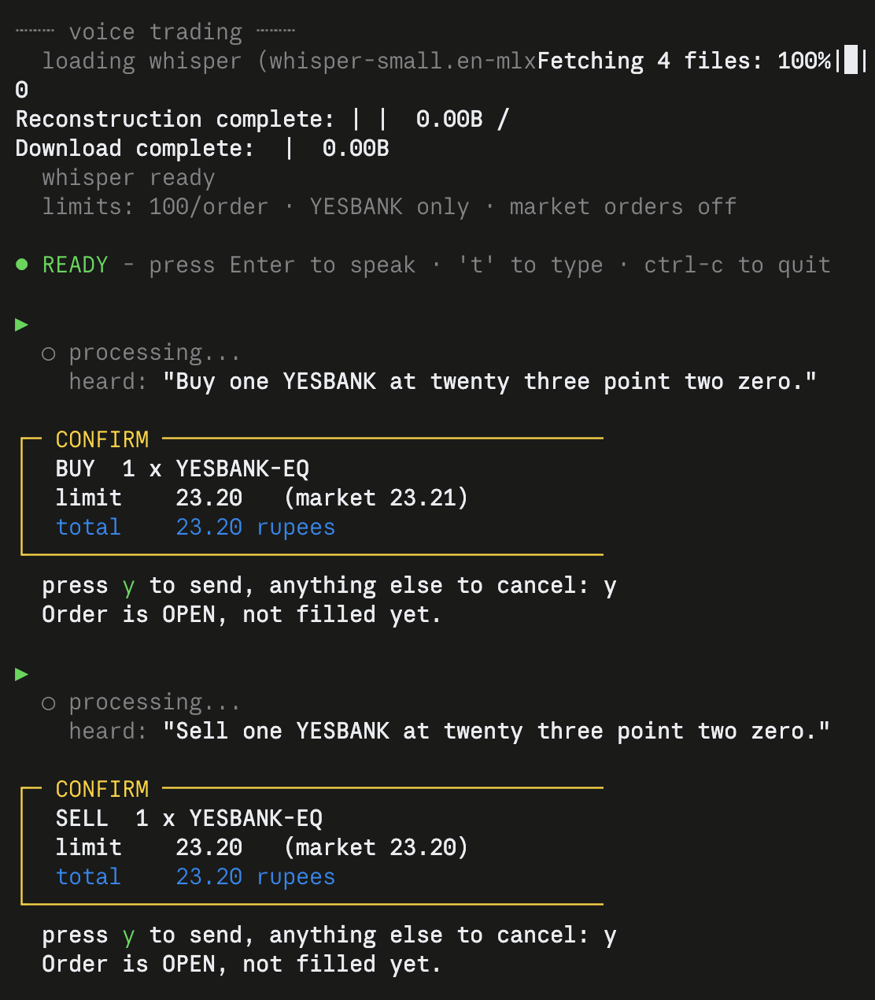
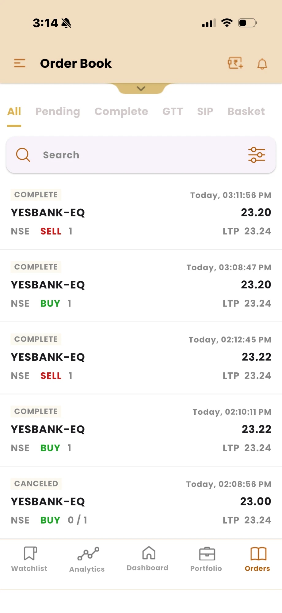
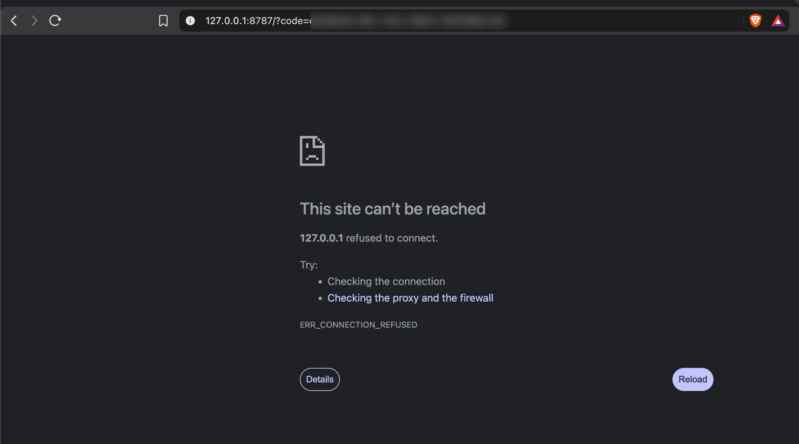

# Sayso

**Nothing trades without your say-so.**

Sayso places real trades on the Indian stock market by voice, through the
[Shoonya](https://shoonya.com) broker API. It is built for traders who watch
charts somewhere else: you say the order, it works out the exact contract,
prices it against the live market, checks it against hard limits, reads it
back to you, and only sends it when you press `y`.

> ### ⚠️ This places real orders with real money
>
> There is no paper-trading mode. Every confirmed order goes to a live
> exchange against a funded account. Sayso is not audited, not
> battle-tested, and not financial advice. Trade sizes you are willing to
> lose entirely, and read the Limitations section before using it.

```
"buy bank nifty call fifty five six hundred"

  Buy 1 lot, Bank Nifty 55600 call, monthly, about 9,452 rupees.   <- spoken
  y send · p set price · anything else cancels: y
  Filled. Bought 1 lot of the Bank Nifty 55600 call at 315.05.      <- spoken
```

Speech recognition runs locally via Whisper; no audio leaves your machine.

**What it trades**

- **Nifty, Bank Nifty and Sensex options** — nearest expiry, at the money
  unless you say a strike. Nifty and Sensex are weekly; Bank Nifty has no
  weekly contract, so it is the nearest monthly, and Sayso says so.
- **Nifty 50 stocks** (plus Yes Bank for testing), intraday or delivery.

**What makes it safe to talk to**

- Nothing is sent until you press `y`, after a readback you can hear.
- Anything ambiguous is asked about, never guessed: which index, which
  company ("hdfc" — bank or life?), which of two open positions to exit.
- Corrections, negations and questions are understood before commands:
  "buy call, no wait, put" buys a put; "don't buy a call" does nothing;
  "should I buy Reliance?" is treated as a question.
- It tells the truth about outcomes. A lost connection is never reported
  as a rejection, an expired session never reads as an empty account, and
  a resting order is followed until it fills.

### Nifty options, by voice



*From the live session on 25 September 2026, when Nifty was the only
index. "Buy call two three one five zero" — no symbol, no expiry, no
price: it read the live Nifty level, picked the nearest weekly expiry,
resolved strike 23150 against the listed ladder, and priced through the
spread. "Exit call" closed the whole position and showed the P&L first.
Today you name the index — "buy Nifty call two three one five zero" — or
it asks which one, and the replies are worded a little differently.*

Two complete round trips on 25 September 2026, both closed within minutes:

| Time | Contract | Side | Price | Result |
|---|---|---|---|---|
| 12:13:41 | NIFTY 29SEP26 23100 PE | BUY 65 | 96.30 | |
| 12:14:38 | NIFTY 29SEP26 23100 PE | SELL 65 | 96.90 | **+₹39.00** |
| 13:18:20 | NIFTY 29SEP26 23150 CE | BUY 65 | 72.35 | |
| 13:19:16 | NIFTY 29SEP26 23150 CE | SELL 65 | 72.60 | **+₹16.25** |

<p>


</p>

*The broker's own order book and portfolio, confirming the same four fills
and ₹55.25 total. Each leg is 65 units — one Nifty lot.*

### Equity, independently verified



The same trades, in Shoonya's own order book — timestamps matching the
terminal session exactly:



| Time | Side | Price | Status | Placed by |
|---|---|---|---|---|
| 15:11:56 | SELL 1 YESBANK-EQ | 23.20 | COMPLETE | **voice** |
| 15:08:47 | BUY 1 YESBANK-EQ | 23.20 | COMPLETE | **voice** |
| 14:12:45 | SELL 1 YESBANK-EQ | 23.22 | COMPLETE | API |
| 14:10:11 | BUY 1 YESBANK-EQ | 23.22 | COMPLETE | API |
| 14:08:56 | BUY 1 YESBANK-EQ | 23.00 | CANCELED | API |

Two complete round trips on 23 September 2026 — the second placed entirely
by speaking. Total cost in brokerage: ₹0.07.

---

## How it works

```
mic → Whisper (local) → understand → resolve contract → live price
                                                            ↓
                                                     safety limits
                                                            ↓
                               spoken readback + confirmation   ← you press y
                                                            ↓
                              broker → followed until filled → spoken result
```

Voice proposes, you dispose. The contract always comes from the broker's
own symbol master, never from something typed or guessed, and what you
confirm is exactly what is sent.

## Tutorial

New to this? [TUTORIAL.md](TUTORIAL.md) walks from a fresh clone to your
first voice-placed trade.

## Setup

Requires Python 3.12+, a microphone, and a Shoonya account with API access.
Runs on macOS and Windows; speech recognition uses MLX on Apple Silicon and
faster-whisper elsewhere, both fully local.

```bash
./setup.sh                                          # macOS / Linux
powershell -ExecutionPolicy Bypass -File setup.ps1  # Windows
```

Then, once per machine:

```bash
.venv/bin/python -m voice.calibrate       # measures your microphone
```

Once per trading day, then run it:

```bash
.venv/bin/python -m shoonya.login
.venv/bin/python -m voice.main
```

If anything misbehaves, `python -m voice.doctor` checks each piece and names
the fix.

Login opens the broker's page in your browser. Afterwards it redirects to
`127.0.0.1`, which shows a connection error — **that is expected**. The login
code is in the address bar; paste it back.



Login asks for your API credentials — client ID, user ID and secret code —
each time. **They are never saved**: they are used once to log in and
dropped. The only thing kept is the day's session, which expires on its own,
in a file only you can read. Your password and OTP go to the broker, never
to this program.

**The API key only works from the internet addresses registered for it**
(a SEBI rule for API trading). Home broadband and phone hotspots can change
address without warning, and the broker's refusal doesn't say why — so
login asks once for the registered address, and login, the app and
`voice.doctor` all check this computer is on it before anything is sent.
`python -m shoonya.network` checks on demand; the lookup is one request to a
public what's-my-IP service, never on the order path.

**More than one account?** Add `--account NAME` to login and to the app.
Each account keeps its own login session and daily limits, and the app
shows the ID you are actually logged in as:

```bash
.venv/bin/python -m shoonya.login --account client
.venv/bin/python -m voice.main --account client
```

## What you can say

**Index options.** Name the index; if you don't, it asks.

```
buy nifty call                         buy sensex put
buy bank nifty call fifty five six hundred
buy nifty put two three one zero zero          (digit by digit works)
buy 2 lots of sensex call seventy four thousand
what is the bank nifty put at
exit call                              exit the sensex put
exit the 23100 call
```

Strikes are checked against the contracts actually listed, so "twenty three
fifty" becomes 23,050 and an unlisted strike like 23,075 is refused. A
strike that belongs to another index is pointed out, not switched to.

**Stocks.** Nifty 50 names, said naturally. It asks "intraday or delivery?"
unless you say it.

```
buy 10 reliance intraday               buy one infosys for the day
buy 2 l and t delivery                 what is hdfc bank at
sell my reliance
```

**Every word needs a job.** An order is read only if each word in it is an
action, an index, call or put, a company, a number in a clear role, intraday
or delivery, or harmless filler ("the", "at market", "ATM", "weekly", "um").
Anything else — "stop loss 5", "next expiry", "worth 500" — gets *"I didn't
follow …"* and an example, never a guess. Numbers have fixed roles:

- **lots** — "2 lots", or said right before the index: "buy 2 Nifty calls"
- **strike** — any other number: "buy Nifty call 23100". "Buy Nifty call 5"
  asks whether you meant 5 lots.
- **a price** after "at" or "for" — options refuse it, since they go at
  market; for stocks it's shown on the confirmation screen

Corrections swap one thing of the same kind: "no wait, put", "make it two
lots" (keeps the strike), "sorry, 23150" (keeps the lots). A bare "no" —
"call, no put" — is asked about. "Close half" / "sell half" works, in whole
lots or shares. Questions ("did I buy…", "is my call closed?") and "won't",
"can't", "don't" never trade. Company names are matched exactly; a partial
name ("bharat") is confirmed, and near-misses are refused.

`tests/test_phrasebook.py` lists what each kind of sentence does.

**Answers to its questions** are one word: "bank nifty", "delivery",
"three". Anything else drops the question.

**Your account:** `funds`, `what do I own`, `show me my orders`,
`what are my limits`. Say `cancel` or `never mind` to call something off.

## Safety

Hard limits live in `voice/safety.py` and are enforced in code, whatever was
said or understood:

| Limit | Default |
|---|---|
| Lots per option order | Nifty 10 · Bank Nifty 3 · Sensex 10 |
| Option orders per day | 10 (opening trades only) |
| Stocks tradeable | Nifty 50, plus Yes Bank for testing |
| Equity order value | ₹15,000 per order, ₹50,000 per day |
| Selling options to open | refused |
| Selling more stock than you hold | refused |

Closing a position is never blocked by a limit — a cap that stops you
exiting traps you in the trade. Daily counters persist to disk and are kept
per account.

Orders go at market. Shoonya has no market order type, so "at market" is a
limit priced two ticks through the spread, which fills at once with a
bounded worst case. Press `p` at the confirmation to set your own price.

## Spoken readback

Every preview is read out before you press `y`, and every result after,
with a sound first so you know what happened without looking away from the
chart. There are only three to learn:

| Sound (macOS) | Means |
|---|---|
| Glass | filled |
| Tink | placed, waiting to fill |
| Basso | rejected |
| Pop | anything else — part filled, unknown, a question, or nothing done: listen to the words |

Hear them, each followed by its meaning, with
`.venv/bin/python -m voice.speak`. A resting
order is followed for five minutes and announced when it fills.

Pressing Enter to talk stops any speech at once and opens the microphone —
push-to-talk, like a radio. Nothing is spoken while it records, so it
cannot hear its own readback as a command. It uses the operating system's own voice — an Indian
English one on macOS when installed — and needs nothing extra. Turn it off
with `"speak": false` in `config.json`.

## Stocks

The Nifty 50 as of the September 2025 rebalance, plus Yes Bank for cheap
testing. The list is fixed on purpose: index options are the focus, and a
short known list can be checked by hand. A name that could be two companies
is asked about; an unknown one is refused, never guessed.

## Limitations

- **Windows is written but untested.** The setup script, the faster-whisper
  backend and Windows speech are in place, but no Windows machine was
  available to run them. `voice.doctor` is the thing to send back.
- **No cancelling or modifying an order by voice.** Positions can be opened
  and closed by voice; a resting order has to be cancelled in the broker's
  app.
- **Fills are polled, not streamed.** A resting order is checked every two
  seconds for five minutes. A websocket would be faster and cheaper.
- **Understanding is rule-based.** It handles a wide range of phrasings,
  corrections and questions, and unrecognised speech fails safe ("I didn't
  catch an instruction"), but it is not a language model.
- **A strike correction drops an earlier quantity.** "Buy 2 lots of call
  23100, no, 23050" becomes one lot. The preview shows the lots.

## Notes on the Shoonya API

Things that cost real time to discover, documented so they cost you less:

- **The published quick-start does not match the shipped SDK.** There is no
  `gen_access_token()`. The real method is
  `getAccessToken(authcode, secret_code, client_id, uid)`; it computes the
  SHA256 checksum itself and returns a tuple, not a dict.
- **The SDK sets no network timeouts** on any of its thirty calls. One
  stalled connection hangs the program indefinitely.
- **An empty result and an expired session look the same.** Both come back
  `stat: "Not_Ok"`, and the SDK turns both into `None`. Only the message
  differs: `"no data"` versus `"Session Expired"`.
- **The quote endpoint sometimes returns the wrong instrument** — observed
  answering an option request with the Nifty index. Check the token in every
  quote before pricing anything from it.
- **`stat: "Ok"` from placing an order means received, not accepted.** The
  exchange can still reject it moments later; follow it in the order book.
- **There is no market order type.** Only `LMT` and `SL-LMT` are accepted.
- **Option symbols are not what the docs say.** NIFTY weeklies look like
  `NIFTY29SEP26C23100`. SENSEX options are on `BFO`, listed under the symbol
  `BSXOPT`, in two layouts — `SENSEX26O0173900PE` for weeklies and
  `SENSEX26OCT86000PE` for monthlies — with CE/PE at the end. Read symbols
  from the symbol master; never build them.
- **Symbol masters are public** at `api.shoonya.com/NFO_symbols.txt.zip`
  (and `BFO_`, `NSE_`), no login needed. Search, by contrast, is refused
  for any segment not enabled on your account.
- **Bank Nifty has no weekly expiry**, and **SENSEX spot is BSE token 1** —
  token 47 is SENSEX50.
- **BFO rejects `prd: "I"`**; use `M`. The docs say enabled segments appear
  in a `prarr` array in the limits response; it isn't there.
- **Searching for a symbol containing `&`** (such as `M&M`) fails — the
  request is form-encoded. Search by company name instead.
- **`cash` reads `0.00` with a funded account**, and `mr_eqt_a` lags a
  same-day deposit until it settles. **`rpnl` is realised P&L** and stays
  zero while a position is open; `urmtom` is the unrealised figure.

## Licence

MIT — see [LICENSE](LICENSE).
